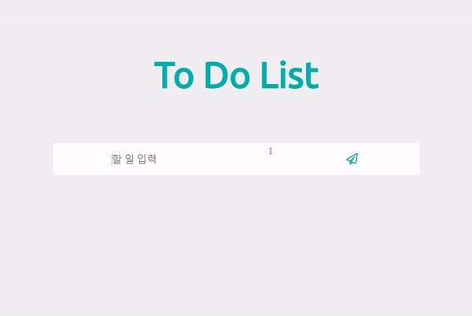
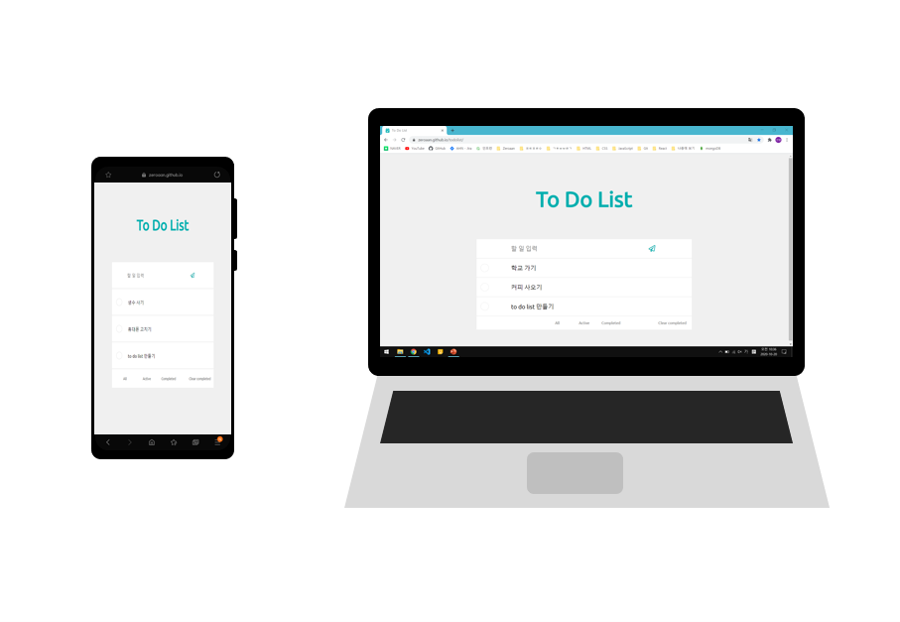

# TodoList

- https://zeroaan.github.io/todolist/
- 기간 : 20년 10월 15일 ~ 10월 16일
- 소개 : React와 Redux를 이용하여 TodoList를 만들어 보았다.

<br>



<br>

- 처음 redux를 접했을 때 class 컴포넌트를 사용해서 mapStateToProps와 mapDispatchToProps, connect함수를 이용했으나 function 컴포넌트를 사용하면서 useDispatch와 useSelector를 사용해 다음과 같이 코드를 만들었다.

<br>

##### src/store/actions/types

- action과 reducer 에서 사용하는 type들을 만들어 주었다.

```js
export const ADD_LIST = "add_list";
export const DELETE_LIST = "delete_list";
export const EDIT_LIST = "edit_list";
export const COMPLETE_LIST = "complete_list";

export const VISIBLE_ALL = "visible_all";
export const VISIBLE_ACTIVE = "visible_active";
export const VISIBLE_COMPLETED = "visible_completed";
export const CLEAR_COMPLETED = "clear_completed";
```

<br>

##### src/store/actions/todo.js

- todo list에서 필요한 action들을 만들어 주었다.

```js
import * as types from "./types";

export const addList = (text) => {
  return {
    type: types.ADD_LIST,
    text: text,
  };
};
// ...생략
export const clearCompleted = () => {
  return {
    type: types.CLEAR_COMPLETED,
  };
};
```

<br>

##### src/store/reducers/todo.js

- todo list에서 필요한 reducer들을 만들어 주었다.
- 이전 상태의 state와 action을 합쳐 새로운 state를 만들어 주었다.

```js
import * as types from "../actions/types";

export default (state, action) => {
  if (state === undefined) {
    state = {
      todo: [],
    };
  }

  let newState = {};
  let newTodo = [];
  let i = 0;
  switch (action.type) {
    case types.ADD_LIST:
      newTodo = [{ text: action.text, complete: false }, ...state.todo];
      newState = { ...state, todo: newTodo };
      return newState;
    // ... 생략
    case types.CLEAR_COMPLETED:
      while (i < state.todo.length) {
        if (state.todo[i].complete === false) {
          newTodo = [...newTodo, state.todo[i]];
        }
        i = i + 1;
      }
      newState = { ...state, todo: newTodo };
      return newState;

    default:
      return state;
  }
};
```

<br>

##### src/components/DisplayList.js

- useDispatch, useSelector를 사용하여 상태관리를 하였다.

```jsx
import React from "react";
import { useDispatch, useSelector } from "react-redux";
import DisplayListItem from "./DisplayListItem";
import * as actions from "../store/actions/todo";
import "./DisplayList.css";

const DisplayList = () => {
  const dispatch = useDispatch();
  const { todo } = useSelector((store) => store.todo);

  const onClickAll = () => {
    dispatch(actions.visibleAll());
  };
  const onClickActive = () => {
    dispatch(actions.visibleActive());
  };
  const onClickCompleted = () => {
    dispatch(actions.visibleCompleted());
  };
  const onClickClearCompleted = () => {
    dispatch(actions.clearCompleted());
  };

  return (
    <>
      {todo.map((item, index) => (
        <DisplayListItem
          key={item.text + index}
          textItem={item.text}
          index={index}
        />
      ))}
      {todo.length > 0 ? (
        <div className="todo__visible">
          <button onClick={onClickAll}>All</button>
          <button onClick={onClickActive}>Active</button>
          <button onClick={onClickCompleted}>Completed</button>
          <p onClick={onClickClearCompleted}>Clear completed</p>
        </div>
      ) : null}
    </>
  );
};

export default DisplayList;
```

<br>

#### 반응형으로 만들어주어 모바일에서도 이용할 수 있도록 하였다.


